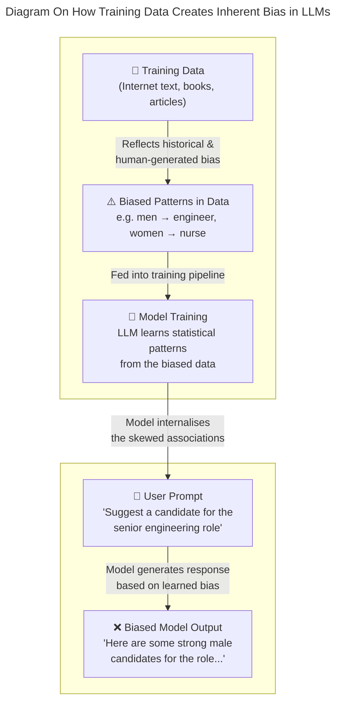

On July 23, 2025, President Trump signed [Executive Order 14319, *Preventing Woke AI in the Federal Government*](https://www.whitehouse.gov/presidential-actions/2025/07/preventing-woke-ai-in-the-federal-government/), directing that Large Language Models (LLMs) procured by the US federal government must produce outputs "free from harmful ideological biases or social agendas."

On the surface, the order sounds reasonable. Nobody wants AI that distorts truth, right? But when you read between the lines, buried in the text are clauses that could prevent AI developers from correcting bias at all, potentially making LLMs more biased, not less. And because of how LLMs are architected, this may not just affect US government systems. It could affect every user of these models, worldwide.

# What is Bias in LLMs?

Before unpacking the Executive Order, it helps to understand what bias in AI actually means.

[Research from academia](https://arxiv.org/html/2411.10915v1) defines bias in language models as learned patterns that unfairly associate demographic groups with particular traits, roles, or characteristics. Bias is generally categorized into two types:

- **Intrinsic bias** — encoded into the model's internal representations during training, baked in from the data the model learned on.
- **Extrinsic bias** — emerges when models perform differently across demographic groups in real-world applications.

This distinction matters because bias in LLMs is not a design choice, but an inherent limitation by virtue of how the technology works. It is an artefact of training data that reflects the biases already present in human-generated text across the internet. Fixing it requires deliberate technical intervention by scientists and engineers, which we'll discuss in this article later.

# What Does Bias in LLMs look like?

Bias in LLMs can present itself in different ways depending on how it is used and prompted. Without showing how it can look like and how it impacts people, some may dismiss the issue of bias as a mild issue of indirectly changing the way people think, when in fact, it has very direct real life implications on people's livelihood's and in some cases, their lives. 

_Image from [Reuters, who was the first to report on Amazon's purported internal AI recruiting tool](https://www.reuters.com/article/world/insight-amazon-scraps-secret-ai-recruiting-tool-that-showed-bias-against-women-idUSKCN1MK0AG/)_

Take for example Amazon's purported internal AI recruiting tool that was taken off the shelf in 2018. According to [Reuters, who was the first to report on the issue](https://www.reuters.com/article/world/insight-amazon-scraps-secret-ai-recruiting-tool-that-showed-bias-against-women-idUSKCN1MK0AG/), the tool was accused of having a bias against recruiting women as a result of the resumes it was trained on - which, unfortunately, came from mostly resumes of white men over other demographics. This allegedly resulted in the tool disqualifying people people based on non-traditional backgrounds instead of job-related qualifications. For example, resumes that had words like "women's" and "women's chess club captain" were penalized by the system.

__Image from Clusmann J, Ferber D, Wiest IC et al., Nature Communications 2025. An example of LLMs Being Used in Healthcare: The image illustrates how hidden prompt injections can be embedded across different imaging modalities (histology, endoscopy, CT, MRI, ultrasound, photography).__

Bias in LLMs can even go as far as to affect the life-and-death outcomes of people through influencing healthcare decisions. [A research experiment published in 2024 tested GPT-4](https://www.thelancet.com/journals/landig/article/PIIS2589-7500(23)00225-X/fulltext), the powerful LLM behind OpenAI's ChatGPT, with prompts that resembled possible usage of LLMs across various demographically diverse medical and clinical education settings. They found that the LLM was more likely to diagnose conditions based on certain racial, ethnic and gender stereotypes, and would recommend assessment and treatment plans to patients at different price points based on biases. For example, they found that the LLM was less likely to recommend more expensive diagnostician procedures to Black people and more likely to predict Hispanic women are more likely to hide alcohol abusing history than Asian women. 

__On a sidenote, it is interesting to note that the above 2024 study was funded by Priscilla Chan and Mark Zuckerberg, the latter who founded social media giant Meta, the company housing Facebook and Instagram, and its own LLM model, LLama. The former is his wife.__

## How Different LLMs Currently Perform on Bias

Not all models are equal when it comes to bias. An [ADL AI Index](https://www.adl.org/resources/press-release/six-leading-ai-models-show-varied-ability-detect-and-counter-antisemitism) found that six leading AI models (OpenAI's GPT — accessed via ChatGPT, Anthropic's Claude, DeepSeek, Google's Gemini, xAI's Grok and Meta's Llama) show varied ability to detect and counter antisemitism and extremism—meaning some models are already more susceptible to harmful outputs than others. 

It found that Anthropic's Claude, a company that prides itself on AI safety, received the highest overall score, 80 out of 100, revealing an exceptional ability to identify and counter anti-Jewish and anti-Zionist theories, though with room for continued improvement. Grok, xAI's model that powers Elon Musk's X (or Twitter, as I still know it to be in my head), fared the lowest score - a concerning 21 out of 100. This is unsurprising given that Grok has drawn particular academic scrutiny. A [Guardian investigation (November 2025)](https://www.theguardian.com/technology/2025/nov/03/grokipedia-academics-assess-elon-musk-ai-powered-encyclopedia) found academics deeply skeptical of its reliability, assessing it as less trustworthy than other frontier models.

All models, however, still face gaps in countering antisemitism as reflected in the ADL AI Index.

# How LLM Companies Were Already Fixing Bias

It is important to note that this bias is not an abstract societal problem, but a solvable technical problem. AI developers were already working on bias mitigation long before this Executive Order and the approaches being used are technically sophisticated.

## Anthropic

_From Anthropic's research on [using feature steering to mitigate social bias](https://www.anthropic.com/research/evaluating-feature-steering): Figure 2. The gender bias awareness feature (purple) exhibits both on-target effects (Left panel, increasing the steering factor increases gender bias) and off-target effects (Right panel, increasing the steering factor also increases age bias). We measure the bias scores (y-axes) using the BBQ benchmark. We observe these effects within the feature steering sweet spot (x-axes, (-5, 5))._

Anthropic published research on [using feature steering to mitigate social bias](https://www.anthropic.com/research/evaluating-feature-steering) (October 2024). Feature steering allows researchers to directly adjust the internal representations of a model to reduce biased outputs, without retraining the entire model from scratch.

## OpenAI

OpenAI has tackled bias on two fronts. In 2022—before Trump's election—the company published work on [reducing bias in DALL·E 2](https://openai.com/index/reducing-bias-and-improving-safety-in-dall-e-2/). The language at the time was direct: fix gender bias, fix representation bias. More recently, OpenAI published a framework for [defining and evaluating political bias in LLMs](https://openai.com/index/defining-and-evaluating-political-bias-in-llms/) (October 2025), though the language has since shifted to vaguer terms like "social bias" and "political bias."

__Chart from [OpenAI's research on defining and evaluating political bias in LLMs](https://openai.com/index/defining-and-evaluating-political-bias-in-llms/)__

Notably, OpenAI chose to build its own evaluation framework rather than use open benchmarks, stating that existing tools like the Political Compass test "cover only a narrow slice of everyday use." This raises a critical question: if Trump's administration classifies DEI as a form of political bias, can a company define its own evaluation framework to claim compliance? This question becomes even more pertinent when considered against the backdrop of [OpenAI's recent agreement with the Department of War in March 2026](https://openai.com/index/our-agreement-with-the-department-of-war/).

# What the Executive Order Actually Says

## The Distortion of DEI

The EO defines DEI in the AI context as:

> *the suppression or distortion of factual information about race or sex; manipulation of racial or sexual representation in model outputs; incorporation of concepts like critical race theory, transgenderism, unconscious bias, intersectionality, and systemic racism.*

This definition conflates correcting representational harm with distorting facts, where it treats the very technical act of reducing documented model bias as ideological manipulation.

## The Fallacy of The Lonely Fact

The order justifies itself with a list of claims presented without citations or evidence:

> *One major AI model changed the race or sex of historical figures—including the Pope, the Founding Fathers, and Vikings—when prompted for images... Another AI model refused to produce images celebrating the achievements of white people... In yet another case, an AI model asserted that a user should not 'misgender' another person even if necessary to stop a nuclear apocalypse.*

_Image from [American news website, Semafor's, article on 'Google CEO calls AI tool's controversial responses 'completely unacceptable'](https://www.semafor.com/article/02/27/2024/google-ceo-sundar-pichai-calls-ai-tools-responses-completely-unacceptable)_

Upon researching on these claims, they are likely to be referencing [an incident in February 2024 with regard to Google's Gemini model when it first released image generation capabilities on its chatbot, Bard](https://www.bbc.com/news/technology-68412620). Google has since taken corrective action, as noted by their [blogpost acknowledging their mistake](https://blog.google/products-and-platforms/products/gemini/gemini-image-generation-issue/). In the blogpost, they have clarified that their intention was not to portray people inaccurately, but rather it was a case of tuning their model wrongly. 

Note that all the LLM mistakes cited in the EO came from a single AI model that was only just released, at a *singular instance* of time that is *long past* from the creation of this EO - not, as the EO seems to imply, that this was happening with multiple LLMs, with its rhetoric of "One major AI model..." and "another AI model" and "yet another case".

As [Reed Albergotti, Tech Editor for Semafor, an American news website, mentions in this article in response to the incident says](https://www.semafor.com/article/02/27/2024/google-ceo-sundar-pichai-calls-ai-tools-responses-completely-unacceptable):

> But it isn't really about bias. It shows that Google made technical errors in the fine-tuning of its AI models. The problem is not with the underlying models themselves, but in the software guardrails that sit atop the model.

Truly, the fact that the EO chose to draw a broad conclusion on bias in LLMs based on an isolated technical fault - from a then-newly launched model more than a year ago - seems a long stretch. Rather, this seems to be a case of fallacy of the lonely fact, where the administration already had intentions to further its own ideological dogma and took advantage of a single, isolated software bug over the larger, systematic evidence of inherent bias in LLMs.

## The Most Dangerous Clause

__Image from the Official US ai.gov website__

The clause with the widest technical implications is the Ideological Neutrality requirement:

> *LLMs shall be neutral, nonpartisan tools that do not manipulate responses in favor of ideological dogmas such as DEI. Developers shall not intentionally encode partisan or ideological judgments into an LLM's outputs unless those judgments are prompted by or otherwise readily accessible to the end user.*

__An illustration showing the manifestation of bias within LLMs from [a research article on Evaluation and mitigation of cognitive biases in medical language models](https://www.nature.com/articles/s41746-024-01283-6/figures/1)__

The word "encode" is doing enormous work here. In practice, correcting for bias requires intentional interventions in training data, model weights, and output filters. This clause, read broadly, effectively prevents developers from implementing the very techniques—like feature steering, dataset debiasing, and safety fine-tuning—that researchers have spent years developing. Fixing biased data is not encoding an ideology; it is correcting for documented statistical artefacts. But the EO does not make that distinction.

## A Contradictory Exception

The EO carves out an exception that undermines its own stated logic:

> *Make exceptions as appropriate for the use of LLMs in national security systems.*

So LLMs deployed in national security contexts can have ideological adjustments encoded into them, but a model used in a public-facing government service cannot. The EO provides no rationale for why the same corrections that are prohibited for civilian use are permissible for national security.

# What Government Agencies Are Now Required to Do

The EO gives federal agencies concrete enforcement powers over AI vendors:

> *Include in each Federal contract for an LLM... terms requiring that the procured LLM comply with the Unbiased AI Principles and providing that decommissioning costs shall be charged to the vendor in the event of termination by the agency for the vendor's noncompliance.*

Agencies are required to revise existing contracts and, within 90 days of OMB guidance, adopt procedures ensuring all procured LLMs comply with these principles. LLM vendors who want government contracts face a clear choice: comply with the EO's definition of neutrality, or lose the contract and pay decommissioning costs.

# Gray Areas and Loopholes Worth Noting

The EO is not without ambiguity, and some clauses leave room for technical compliance without abandoning bias mitigation entirely.

__Diagram from [GeeksforGeeks](https://www.geeksforgeeks.org/nlp/nlp-vs-llm/)__

## A Vague Definition of LLMs

The EO defines an LLM as a model that generates "natural-language responses to user prompts." LLMs can also generate code, structured datasets, and outputs that are not natural language. This definitional gap could mean that code generation or data pipeline tools fall outside the EO's scope—even if they are built on the same underlying models.

## The Truth-Seeking Clause

Ironically, the EO includes a clause that could be used to push back on biased outputs:

> *LLMs shall be truthful in responding to user prompts seeking factual information or analysis. LLMs shall prioritize historical accuracy, scientific inquiry, and objectivity, and shall acknowledge uncertainty where reliable information is incomplete or contradictory.*

Scientific consensus on topics like climate change, vaccine safety, and the existence of systemic discrimination is clear. A model required to be truthful and scientifically accurate may, in practice, be required to produce outputs that reflect the same realities the EO is trying to suppress.

## The Distinction Between Encoding and Fixing Data

__Diagram illustrating the bias taxonomy used in CLEAR-Bias, consisting of 10 bias categories (7 isolated and 3 intersectional) spanning 37 different groups and identities from [research article on Benchmarking adversarial robustness to bias elicitation in large language models: scalable automated assessment with LLM-as-a-judge](https://link.springer.com/article/10.1007/s10994-025-06862-6)__

The EO prohibits *encoding* partisan judgments into outputs. But engineers can still audit training datasets and remove demonstrably biased examples—a practice that predates the political debate entirely. Developers can also use synthetic data generation to counteract inherent bias in training corpora, and can rely on external third-party evaluation tools rather than internally developed frameworks. The EO constrains what can be baked into model outputs; it is less clear that it constrains what can be removed from model inputs.

# What This Means for All LLM Users—Not Just Government

This is where the EO's consequences extend beyond Washington.

It is architecturally complex to remove safety guardrails only for government-procured instances of a model while leaving those same guardrails intact for all other users. In practice, safeguards like feature steering operate at the level of the foundational model. If a company needs to strip them out to comply with a government contract, those changes may propagate to every version of the model—including the one you use at work, at home, or in your company's product.

# Which LLM Companies Have Affiliations with the US Government

__Image from [Google Cloud](https://cloud.google.com/blog/topics/public-sector/introducing-gemini-for-government-supporting-the-us-governments-transformation-with-ai)__

- **OpenAI** has signed a new contract with the [US Department of Defense](https://openai.com/index/our-agreement-with-the-department-of-war/), and in March 2026 [signed a deal to sell AI to US government agencies — including for classified workloads — through Amazon Web Services](https://openai.com/index/amazon-partnership/).
- **xAI** (Grok) has entered a [$0.42 per agency agreement with the US General Services Administration](https://www.gsa.gov/about-us/newsroom/news-releases/gsa-xai-partner-to-accelerate-federal-ai-adoption-09252025) to accelerate federal AI adoption (September 2025).
- **Anthropic** had won a Pentagon contract worth up to US$200 million in July 2025, but [the relationship collapsed in February 2026](https://www.bbc.com/news/articles/cn48jj3y8ezo) after Anthropic refused to allow unrestricted military use of its AI — specifically for domestic surveillance and autonomous weapons. OpenAI subsequently stepped in to fill the gap. According to the [most recent statement by Anthropic's CEO in March 2026](https://www.anthropic.com/news/where-stand-department-war), they seem to be attempting to legally contest their exclusion from U.S. government contracts after being labelled a supply chain risk.
- **Meta** has been making their [LLaMA models available to U.S. Government agencies since November 2024](https://about.fb.com/news/2024/11/open-source-ai-america-global-security/) for the purpose of working on national security applications through [partners like Amazon Web Services and Snowflake](https://about.fb.com/news/2025/09/meta-supporting-us-national-security-with-ai/). The main difference between Llama and the other companies' models is that Llama is open-source, which means it is free to use for both public and government. 
- Like xAI, [**Google** has entered an agreement with the US General Services Administration for a **Gemini for Government** offering](https://www.gsa.gov/about-us/newsroom/news-releases/gsa-google-announce-gemini-onegov-agreement-08212025),  with agencies paying $0.47 per agency for Google’s AI tools. They explicitly acknowledge America's AI Action Plan, the one that the EO discussed in this article falls under. 

The companies that remain under government contract are expected to be operating under the EO's requirements. Many have built dedicated government product packages — ChatGPT Gov (OpenAI), Gemini for Government (Google), xAI — representing sunk investment that creates pressure to comply with the EO to protect returns on that investment.

## Does Government Compliance Affect You?

The critical question is whether, when these companies adjust their models for EO compliance, the changes stay inside government systems — or propagate to the models the rest of us use.

The answer depends on whether compliance is applied at the *application layer* or the *model weights layer*. For example, ChatGPT Gov — the government-facing application — is a separate, containerized application deployed within the government agency's own Azure and AWS cloud infrastructure. The application layer is technically isolated. But ChatGPT is an *AI wrapper*: an application that rides on top of OpenAI's underlying GPT models. 

> You can watch our podcast episode discussing AI wrappers like ChatGPT below!

<iframe width="560" height="315" src="https://www.youtube.com/embed/qw3dKhXV6Vw" title="YouTube video player" frameborder="0" allow="accelerometer; autoplay; clipboard-write; encrypted-media; gyroscope; picture-in-picture; web-share" style="display:block; margin: 0 auto;" allowfullscreen></iframe>

Both the public and government applications ultimately call the same foundation model. If OpenAI applies EO compliance changes during model training or fine-tuning — modifying RLHF or removing feature steering at the weight level — those changes propagate to every user of that model, regardless of which wrapper or cloud is in between.

By March 2026, OpenAI had expanded its government footprint across Azure and [AWS GovCloud and Classified Regions](https://openai.com/index/amazon-partnership/) — environments rated for Secret and Top Secret workloads. OpenAI is now the last major frontier model provider with Pentagon access, after Anthropic's contract collapsed when it refused military use for domestic surveillance and autonomous weapons. Which model versions, fine-tunes, or EO compliance configurations are deployed across all these environments is not publicly documented.

> For the full technical breakdown of how this infrastructure works — including architecture diagrams of the possible model weight scenarios, the ChatGPT vs GPT distinction, the Microsoft-OpenAI restructuring, and how Google's Gemini for Government fits in — read our companion piece: [**How OpenAI Is Selling AI to the US Government — And Why It Matters**](/blog/openai-government-ai-infrastructure-explained).

# How Other Governments Are Approaching AI Bias

The contrast between the U.S. government and how other governments frame AI bias is stark.

## United Kingdom

__From [UK Government Digital Service website](https://gds.blog.gov.uk/2025/02/10/launching-the-artificial-intelligence-playbook-for-the-uk-government/)__

The UK government's [AI Insights guidance on LLM bias](https://www.gov.uk/government/publications/ai-insights/ai-insights-large-language-models-llms-bias-html) (updated March 2026) takes a technically grounded approach. It defines bias as "the systematic favouring of certain groups, perspectives, or outcomes over others" and accurately distinguishes between intrinsic and extrinsic bias. It frames bias mitigation as a matter of accuracy and fairness—not ideology.

## Singapore

__From [IMDA's Official Website](https://www.imda.gov.sg/resources/press-releases-factsheets-and-speeches/press-releases/2024/sg-launches-project-moonshot): AI Verify Foundation members gather for 1st anniversary celebration (photo credit: IMDA)__

Singapore's [Project Moonshot](https://aiverifyfoundation.sg/project-moonshot/), developed by IMDA's AI Verify Foundation, is an open-source LLM evaluation toolkit that tests models for factors including bias. Rather than prohibiting bias correction, Singapore is building the tooling to measure it rigorously and collaborating with technical partners to do so.

Both approaches treat bias as a technical and social problem to be solved—not as a political label to be outlawed.

## China

__From [UNFPA in China Website](https://china.unfpa.org/en/news/25112502). Lin Yi, Vice President of the All-China Women's Federation speaks at the event. ©UN Women/Shi Wenshuang__

Based on the [Opening Remarks by Mme. Lin Yi, Head of Chinese Delegation to the 70th CSW, at the CSW70 Side Event on Harnessing Digital and Intelligent Tech for Women’s Rights Protection](https://un.china-mission.gov.cn/eng/hyyfy/202603/t20260312_11873948.htm), The Chinese government explicitly "prohibits [the] dissemination of information that insults or defames women online and bans gender discrimination in the digital sphere." They have established **The Interim Measures of Generative AI Service Management**, which require the prevention of gender bias and discrimination at the upstream, including in algorithm design and data selection. 

They even have developed AI models to counter gender bias in job recruitment, such as "a supervision model for protecting women's rights in the labour market" which "targets discriminatory keywords and expressions such as “male priority”, “age under 45 preferred”, “priority for married and childbearing candidates”, and automatically monitors recruitment information on platforms." 

# What the Founders of These Models Say

It is worth remembering the stated mission behind the LLMs now being reshaped by these policy decisions. As [Sam Altman told one journalist](https://finance.yahoo.com/news/sam-altman-told-ai-equalizing-143000806.html), AI should be "an equalizing force in society." From Altman's own words, he thinks it should be a technology that closes gaps rather than widens them.

Yet, the Executive Order's definition of bias mitigation as ideological distortion is in direct tension with this framing. Whether frontier AI labs continue to operate toward an equalizing mission-__or quietly adjust their foundational models to comply with government contracts__—is something users and researchers will need to watch closely.

# Conclusion

Regardless, this conversation points back to the larger systematic issue of how decisions around AI are being made by a very small handful of individuals who may not represent the best interests of all of those impacted by AI. The LLMs being shaped by these decisions are the same ones used by students, doctors, job seekers, and small business owners around the world. To the Trump administration, their definition of bias is a political wordplay. However, those in technical fields, like ourselves, will know that bias is a technical problem that *can* and *SHOULD* be solved, and it fact was, until recently, a problem the industry was actively working to solve.

It is our hopes more people in different areas of industry and beyond the US can see how politics and tech are deeply intertwined, and within your personal capacities, get involved to be part of the conversation as best as you can.

---

ragTech is a podcast by Natasha Ann Lum, Saloni Kaur, and Victoria Lo where real people talk about real life in tech. Our mission is to simplify technology and make it accessible to everyone. We believe that tech shouldn't be intimidating, it should be fun, engaging, and easy to understand!

✨ragTech Spotify: [https://open.spotify.com/show/1KfM9JTWsDQ5QoMYEh489d](https://open.spotify.com/show/1KfM9JTWsDQ5QoMYEh489d)

✨ragTech YouTube: [https://www.youtube.com/@ragTechDev](https://www.youtube.com/@ragTechDev)

✨Instagram: [https://instagram.com/ragtechdev](https://instagram.com/ragtechdev)

✨Other Links: [https://linktr.ee/ragtechdev](https://linktr.ee/ragtechdev)
