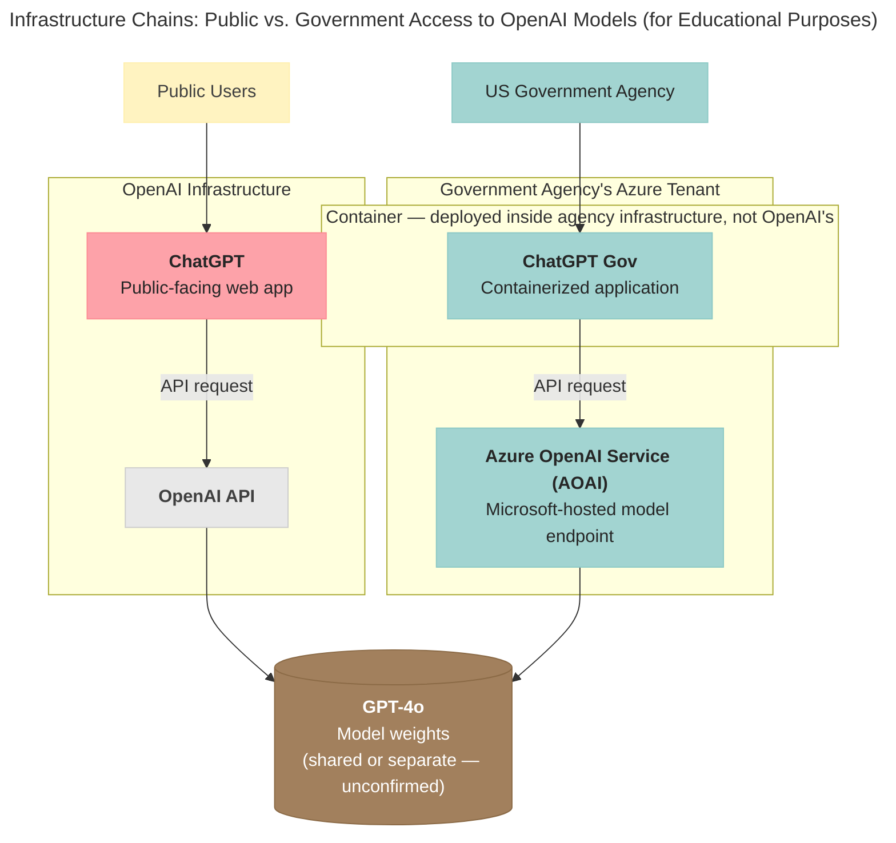
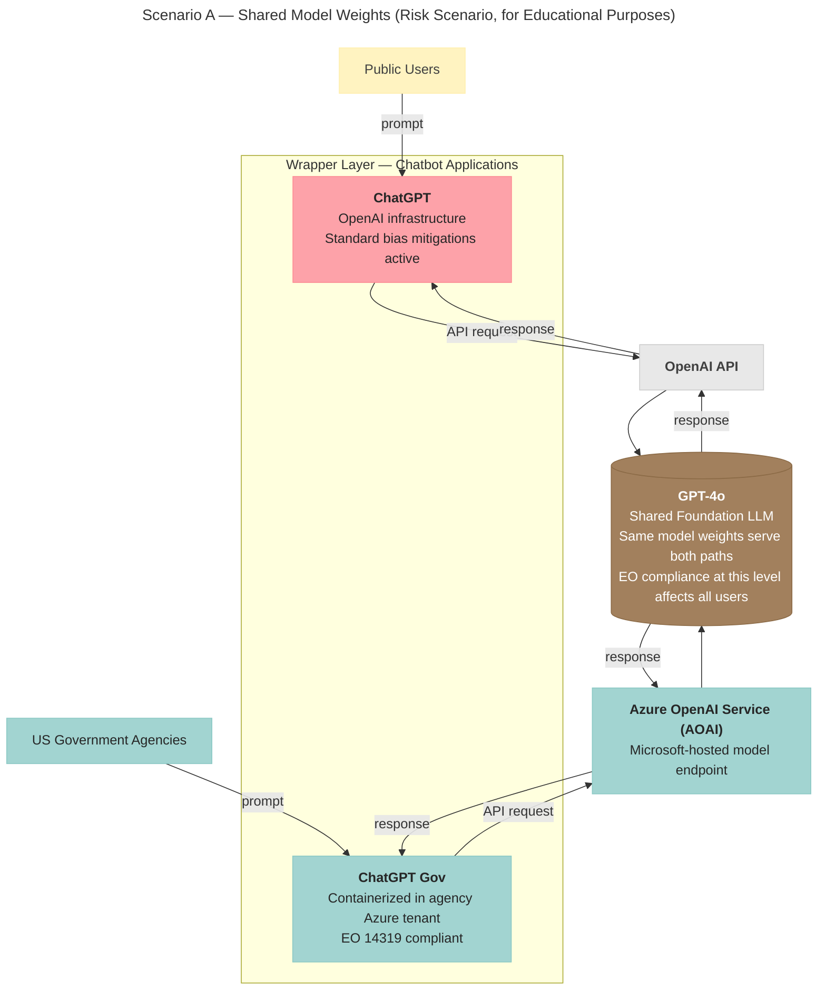
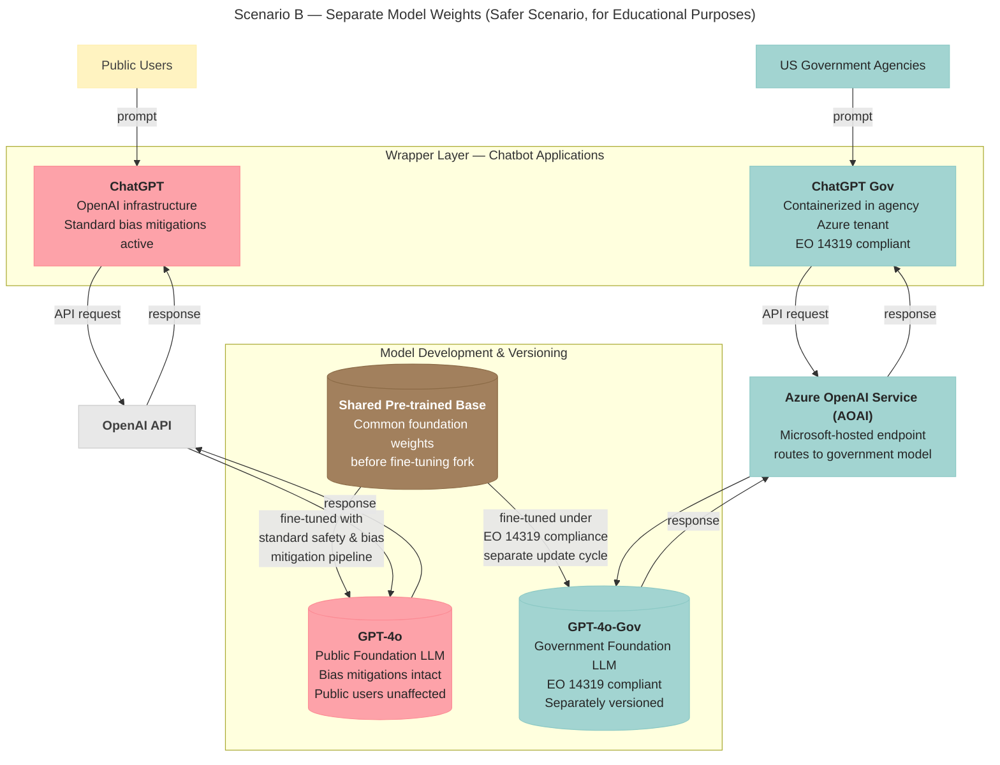
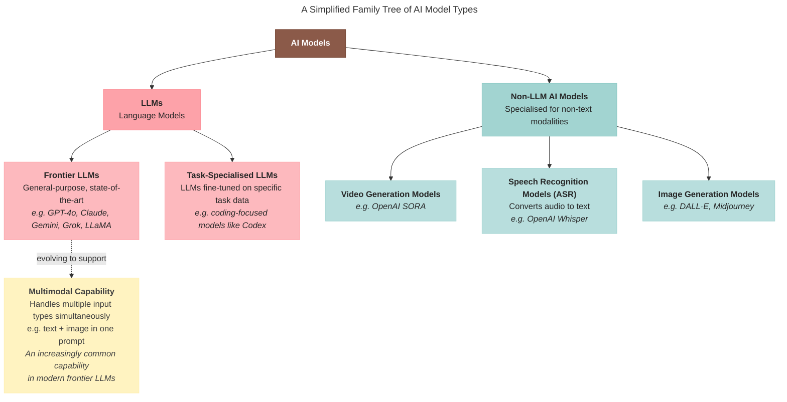
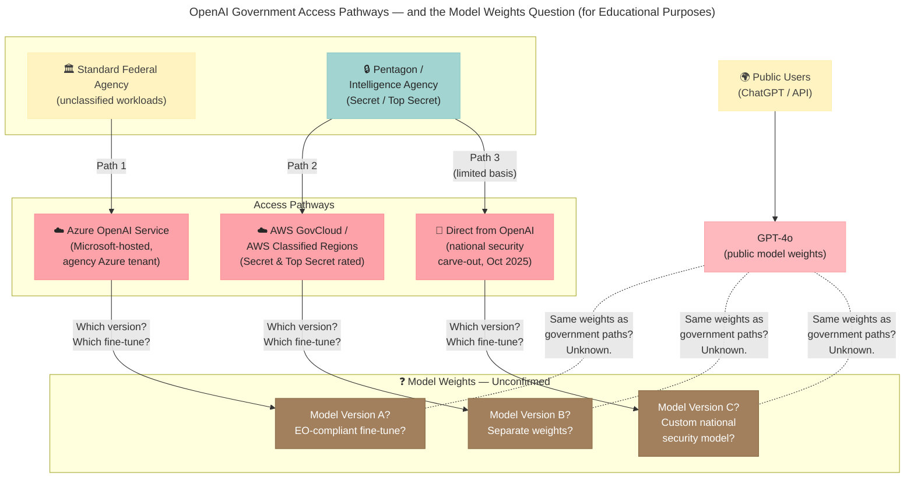

*This is the companion technical deep-dive to [**How Trump's Anti-Woke AI Executive Order Could Actually Make LLMs More Biased**](/blog/trump-anti-woke-ai-executive-order-bias). That article examines why the EO banning "woke AI" could paradoxically make LLMs more biased — for government and public users alike. A key part of that argument rests on how AI is actually being deployed to the US government. That is what this piece unpacks.*

---

Trump's [Executive Order 14319](https://www.whitehouse.gov/presidential-actions/2025/07/preventing-woke-ai-in-the-federal-government/) requires that LLMs procured by the federal government be free from what it defines as ideological bias. But the order's consequences depend entirely on a question it doesn't answer: when AI companies adjust their models to comply, do those changes stay within government systems...or do they propagate to every user of those models worldwide?

To understand the risk, you need to understand how the infrastructure actually works. This article breaks that down.

# Which AI Companies Have Government Contracts

__Image from [Google Cloud](https://cloud.google.com/blog/topics/public-sector/introducing-gemini-for-government-supporting-the-us-governments-transformation-with-ai)__

As of early 2026, the major frontier model providers with active US government relationships are:

- **OpenAI** has signed a new contract with the [US Department of Defense](https://openai.com/index/our-agreement-with-the-department-of-war/), and in March 2026 [signed a deal to sell AI to US government agencies — including for classified workloads — through Amazon Web Services](https://openai.com/index/amazon-partnership/).
- **xAI** (Grok) has entered a [$0.42 per agency agreement with the US General Services Administration](https://www.gsa.gov/about-us/newsroom/news-releases/gsa-xai-partner-to-accelerate-federal-ai-adoption-09252025) to accelerate federal AI adoption (September 2025).
- **Anthropic** had won a Pentagon contract worth up to US$200 million in July 2025, but [the relationship collapsed in February 2026](https://www.bbc.com/news/articles/cn48jj3y8ezo) after Anthropic refused to allow unrestricted military use of its AI — specifically for domestic surveillance and autonomous weapons. OpenAI subsequently stepped in to fill the gap. According to the [most recent statement by Anthropic's CEO in March 2026](https://www.anthropic.com/news/where-stand-department-war), they seem to be attempting to legally contest their exclusion from U.S. government contracts after being labelled a supply chain risk.
- **Meta** has been making their [LLaMA models available to U.S. Government agencies since November 2024](https://about.fb.com/news/2024/11/open-source-ai-america-global-security/) for the purpose of working on national security applications through [partners like Amazon Web Services and Snowflake](https://about.fb.com/news/2025/09/meta-supporting-us-national-security-with-ai/). The main difference between Llama and the other companies' models is that Llama is open-source, which means it is free to use for both public and government. 
- Like xAI, [**Google** has entered an agreement with the US General Services Administration for a **Gemini for Government** offering](https://www.gsa.gov/about-us/newsroom/news-releases/gsa-google-announce-gemini-onegov-agreement-08212025),  with agencies paying $0.47 per agency for Google’s AI tools. They explicitly acknowledge America's AI Action Plan, the one that the EO discussed in this article falls under. 

The companies that remain under government contract are expected to be operating under the EO's requirements. All have built dedicated government product packages, which is a clear signal of sunk investment, and pressure to comply in order to recover it.

# OpenAI for Government

__Image from [PetaPixel](https://petapixel.com/2024/08/01/openai-promises-to-provide-us-government-early-access-to-future-foundational-ai-models/)__

OpenAI launched **[OpenAI for Government](https://openai.com/global-affairs/introducing-openai-for-government/)** on June 16, 2025 — a month *before* the EO was signed. Through the offering, they provide the US government with:

- Their most capable models within secure and compliant environments, including through ChatGPT Enterprise and [ChatGPT Gov](https://openai.com/global-affairs/introducing-chatgpt-gov/)
- Custom models for national security, offered on a limited basis
- Hands-on support
- Insight into upcoming model capabilities so government customers can plan ahead

The models and products are tailored to government needs, but it is unclear whether the customization isolates EO-compliant configurations from the models the rest of the world uses.

# ChatGPT Gov: What the Deployment Actually Looks Like

[ChatGPT Gov](https://openai.com/global-affairs/introducing-chatgpt-gov/) is described as "a new tailored version of ChatGPT designed to provide U.S. government agencies with an additional way to access OpenAI's frontier models."

__From [Microsoft Azure's Dev Blog: Azure OpenAI Service now authorized for all U.S. Government data classification levels](https://devblogs.microsoft.com/azuregov/azure-openai-authorization/)__

The deployment is more technically isolated than the name alone implies. According to [Microsoft Azure's developer blog](https://devblogs.microsoft.com/azuregov/azure-openai-authorization/), ChatGPT Gov runs as a containerized image deployed directly into the government agency's own Azure tenant — using services like AKS, Azure PostgreSQL, and Azure OpenAI (AOAI). The application itself lives within the government's infrastructure, not OpenAI's.

Critically, AOAI — Azure OpenAI Service — is Microsoft's hosted version of OpenAI's models. This means the infrastructure chain for government users is distinct from the one public users travel:

This picture became more complicated in October 2025, when Microsoft and OpenAI [announced a restructuring of their partnership](https://blogs.microsoft.com/blog/2025/10/28/the-next-chapter-of-the-microsoft-openai-partnership/). One of its provisions is that OpenAI can now provide API access to US government national security customers **regardless of the cloud provider** — meaning OpenAI can serve these customers directly, bypassing Azure entirely. 

__Image from [Amazon News](https://www.aboutamazon.com/news/aws/amazon-open-ai-strategic-partnership-investment)__

This matters because it makes the architecture more complex than a simple shared-model question. The application layer is separate. But the key unresolved variable is not the wrapper — it is the model weights that both paths ultimately call. The next two sections unpack what that means.

# The Distinction Between ChatGPT, an AI Wrapper, and GPT, an LLM

While OpenAI's language suggests the LLMs offered to the US government could be customized and hence different from the ones the public uses, it is first important to understand the distinction between what ChatGPT is versus what the GPT models are.

ChatGPT is essentially an *AI wrapper* — a chatbot application that requests data from OpenAI's frontier models, including the various versions of GPT. It is *not* an LLM. Rather, it is an application that *rides* on an LLM.

> You can watch our podcast episode discussing AI wrappers like ChatGPT below!

<iframe width="560" height="315" src="https://www.youtube.com/embed/qw3dKhXV6Vw" title="YouTube video player" frameborder="0" allow="accelerometer; autoplay; clipboard-write; encrypted-media; gyroscope; picture-in-picture; web-share" style="display:block; margin: 0 auto;" allowfullscreen></iframe>

# What This Means for the Public

The infrastructure isolation of ChatGPT Gov actually makes the "separate model" scenario — where a distinct, EO-compliant LLM is maintained for government use — more architecturally plausible than it might initially appear. Running entirely within the government's own Azure tenant gives OpenAI and Microsoft the technical means to point government traffic at a differently fine-tuned model, without touching the one public users access.

However, this does not eliminate the risk to public users. The unresolved variable is not the wrapper — it is what happens at the level of the foundational model weights. If OpenAI applies EO compliance changes during training or fine-tuning (for example, by modifying RLHF or removing feature steering at the model level), those changes propagate to every version of the model, regardless of how the application layer is deployed. Azure OpenAI Service typically serves the same underlying model weights as OpenAI's public API — Microsoft does not independently train them. 

__Image from [OpenAI](https://openai.com/index/next-chapter-of-microsoft-openai-partnership/)__

This is confirmed by the terms of the [October 2025 Microsoft-OpenAI partnership restructuring](https://blogs.microsoft.com/blog/2025/10/28/the-next-chapter-of-the-microsoft-openai-partnership/), which explicitly excludes model architecture, model weights, inference code, and fine-tuning code from Microsoft's IP rights. However, the restructuring also introduced a national security carve-out allowing OpenAI to serve US government customers directly — adding a further layer of uncertainty about which model weights government systems are actually accessing.

The diagram below illustrates the scenario where the shared model scenario holds: ChatGPT and ChatGPT Gov are separate chatbot applications (AI wrappers) that both send API requests to the same underlying GPT-4o model. If EO compliance is baked into the model weights, the wrapper separation offers no protection for public users.

The Azure deployment detail makes the second scenario — a separately maintained, EO-compliant LLM — more credible. OpenAI also offers "Custom models for national security, offered on a limited basis", which signals both the willingness and the technical capacity to fork their model development for government use. Combined with the containerized, tenant-isolated deployment of ChatGPT Gov, a possible architecture for that separation might look like this:

Even so... These custom models OpenAI refers to might not mean customizations of its LLM range (i.e. the GPT-4o range), but rather new AI models trained from scratch that may not be LLMs in the first place.

## Wait... Aren't AI Models LLMs?

Yes, this is an important distinction — while LLMs are AI models, AI models go well beyond LLMs alone.

In the LLM family, frontier models are general-purpose models — GPT-4o, Claude, Gemini, Grok, LLaMA. Coding models are still LLMs: language models fine-tuned on large corpora of code, optimized for software engineering tasks rather than general conversation.

Then there are specialised models for other modalities: video generation models like [OpenAI's SORA](https://help.openai.com/en/articles/20001152-what-to-know-about-the-sora-discontinuation) (being discontinued April 26, 2026), and automatic speech recognition (ASR) models like [OpenAI's Whisper](https://openai.com/index/whisper/), which converts spoken audio to text. And there are *multimodal* models — a single model that handles multiple input types simultaneously. Modern frontier LLMs like GPT-4o and Gemini are increasingly multimodal: you can feed them a photo and ask a question about it in the same prompt.

There are [a total of 83 models OpenAI has made publicly known on their official website](https://developers.openai.com/api/docs/models/all), including those that have been deprecated.

This means that OpenAI's **OpenAI for Government** offering — which includes "Custom models for national security, offered on a limited basis" — may or may not include customization of their LLMs specifically. It remains unconfirmed how OpenAI intends to comply with the EO, and whether their compliance would affect users beyond the US Government.

# OpenAI's Expansion Through AWS

OpenAI's government footprint expanded significantly beyond Azure in 2026. In November 2025, [OpenAI and AWS announced a $38 billion multi-year strategic partnership](https://openai.com/index/amazon-partnership/), making OpenAI's models available through Amazon Bedrock — AWS's managed AI service. This was directly tied to the national security carve-out in the October 2025 Microsoft-OpenAI restructuring, which permitted OpenAI to serve US government national security customers regardless of cloud provider.

__Image from [The Straits Times](https://www.straitstimes.com/business/companies-markets/openai-turns-to-amazon-in-50b-cloud-services-deal-after-restructuring) obtained through Reuters__

That provision was exercised almost immediately. By March 2026, OpenAI had [signed a deal to sell AI to US government agencies through AWS](https://openai.com/index/amazon-partnership/), covering both unclassified and classified workloads. OpenAI's models are now available in AWS GovCloud and AWS Classified Regions — environments rated for Secret and Top Secret workloads — giving the Pentagon and intelligence agencies access to OpenAI models through an entirely separate infrastructure chain from Azure.

Government agencies can now access OpenAI models through at least two distinct cloud paths — Azure OpenAI Service and AWS GovCloud — and potentially directly from OpenAI for national security workloads. OpenAI retains control over which models are made available through AWS, and requires advance notice before AWS can enable access for especially sensitive intelligence customers. But the public has no visibility into which model versions, fine-tunes, or EO compliance configurations are deployed in each environment.

The timing is also notable: OpenAI's AWS government deal came directly after [Anthropic's Pentagon contract collapsed in February 2026](https://www.anthropic.com/news/where-stand-department-war), when Anthropic refused to allow unrestricted military use of its AI — specifically for domestic surveillance and autonomous weapons. OpenAI, now the last major frontier model provider with Pentagon access, is distributing that access through two of the world's largest cloud platforms.

# What Remains Unknown

While this article does a deepdive on OpenAI and does not expand into other companies' model offerings to government, across all major models government offerings, the same gap exists: the public has no visibility into which specific model versions are deployed in government environments, what EO compliance configurations have been applied, or whether those configurations affect the foundational model weights that public users share.

The companies operating under government contracts are the same companies whose models are used by students, doctors, job seekers, and small business owners around the world. Until this is transparent, the question of whether government AI policy is shaping the AI tools the rest of us use every day cannot be answered.

> For the broader argument about why the EO's approach to bias is technically flawed — and why banning bias correction could make LLMs more biased for everyone — read the companion piece: [**How Trump's Anti-Woke AI Executive Order Could Actually Make LLMs More Biased**](/blog/trump-anti-woke-ai-executive-order-bias).

---

ragTech is a podcast by Natasha Ann Lum, Saloni Kaur, and Victoria Lo where real people talk about real life in tech. Our mission is to simplify technology and make it accessible to everyone. We believe that tech shouldn't be intimidating, it should be fun, engaging, and easy to understand!

✨ragTech Spotify: [https://open.spotify.com/show/1KfM9JTWsDQ5QoMYEh489d](https://open.spotify.com/show/1KfM9JTWsDQ5QoMYEh489d)

✨ragTech YouTube: [https://www.youtube.com/@ragTechDev](https://www.youtube.com/@ragTechDev)

✨Instagram: [https://instagram.com/ragtechdev](https://instagram.com/ragtechdev)

✨Other Links: [https://linktr.ee/ragtechdev](https://linktr.ee/ragtechdev)